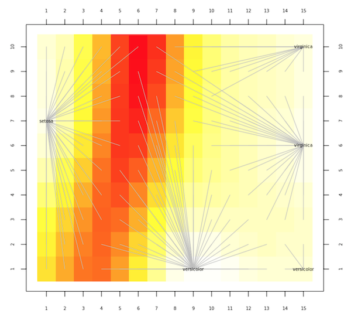

# Background

The self-organizing map (SOM) was developed by Teuvo Kohonen for data exploration and
data visualization in the 1980s [@kohonen2001self]. It is an artificial neural
network designed for unsupervised learning.  What makes the self-organizing map so attractive are the intuitive mathematical
underpinnings and the straightforward visualization of computational
results [@ultsch1990self]. Self-organizing maps have been applied in virtually every scientific discipline where some sort of data exploration or analysis is
necessary, e.g., [@liakos2018machine; @mathys2019single; @matic2018interpreting;
@miller1996star].  A number of R-packages exits that implement self-organizing maps including
[@kohonen2018jss] and [@som2016R].


# Statement of need

Training a self-organizing map is time consuming. Here
we introduce an R-package called `popsom` [@popsom2021R] that implements a training algorithm
for self-organizing maps based on vector and matrix operations inspired by
tensor algebra [@hamel2018vsom].  We have measured speed ups of the training phase
of a SOM  of up to 60 times using our implementation over traditional implementations of the training algorithm such as
[@som2021R].  This speedup enables researchers to look at much larger data sets or to improve
their throughput with a given data size.

Visualization of a trained map is at the core of using self-organizing maps.  The
`popsom` package improves on the standard u-matrix visualization
for self-organizing maps [@ultsch1990self] by superimposing starbursts in order to
highlight cluster structures [@hamel2011improved].

# Description

At a slightly more detailed level our `popsom` package implements
Kohonen's self-organizing maps with a number of distinguishing features:

1. A very efficient, single threaded, stochastic training algorithm based on ideas from tensor algebra.  Up to 60x faster than traditional single-threaded training algorithms. No special accelerator hardware is required.  The speedup results from the fact that the
vector and matrix structures exposed by our algorithm map neatly into
vector and matrix operations available on today's CPUs.  Our Fortran 90 implementation
insures that these vector and matrix operations are mapped onto the hardware as efficiently as
possible [@hamel2018vsom].

2. Automatic centroid visualization and detection using starbursts [@hamel2011improved]. Not
only does `popsom` display clusters and centroids on the map using starbursts but it
also computes a cluster model similar to a k-means model based on the starbursts.  

3. The `popsom` package maintains two models of the given training data: (a) a
self-organizing map model where elements of the map model are available to
the user for analysis, and (b) a centroid based clustering model similar to a k-means
model where centroid and cluster information is available to the user.  Having these
two perspectives of a dataset is often helpful during a data analysis.

4. A number of easily accessible quality metrics for the self-organizing map and the centroid based cluster models. In particular, the package computes the `convergence` of a map which is a linear combination of the variance captured and the topographic fidelity of the map. A value close to 1 means a converged map. Furthermore, `popsom` also computes the `separation` of the clusters
in a model. This is computed by the formula $1 - wcss/bcss$.  In general, a value close to 1 means well separated clusters.

# Usage

`popsom` is available on [CRAN](https://CRAN.R-project.org/package=popsom) and can be installed and loaded into an R session using,
```
> install.packages("popsom")
> library(popsom)
```
Binary packages for `popsom` are available from CRAN for macOS, Linux, and Windows.  If you are on a system
that is not supported by CRAN you can download and compile the package from
[GitHub](https://github.com/lutzhamel/popsom).

The following is a simple use-case for `popsom` exercising some of the functionality
it has to offer,
```
> ## load a data set
> data(iris)
>
> ## set data frame and labels
> df <- subset(iris,select=-Species)
> labels <- subset(iris,select=Species)
>
> ## build a self-organizing map
> m <- map(df,labels,xdim=15,ydim=10,train=100000)
>
> ## compute a summary and display it
> summary(m)

Training Parameters:
  xdim ydim alpha train normalize seed instances
    15   10   0.3 10000      TRUE NULL       150

Quality Assessments:
  convergence separation clusters
         0.99       0.98        5
>
> ## display a starburst plot of the map model
> starburst(m)
```
The last line of the R script generates the starburst visualization shown
in \autoref{fig:map}.  A more involved usage example can be found on
[Kaggle](https://www.kaggle.com/lutzhamel/self-organizing-maps-in-customer-segmentation).



# Acknowledgements

Many thanks to the people who have contributed to this project. A special thanks to the
following in no particular order: Benjamin Ott, Gregory Breard,  Robert Tatoian,
Michael Eiger, and Vishakh Gopu.

# References
